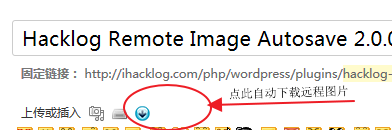
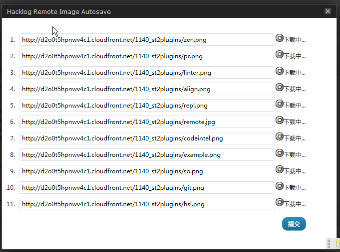
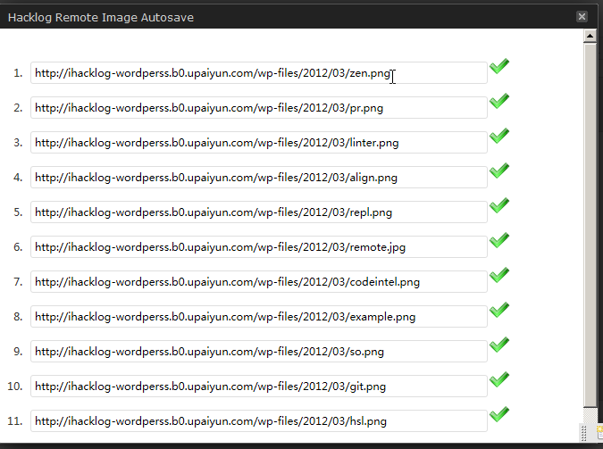
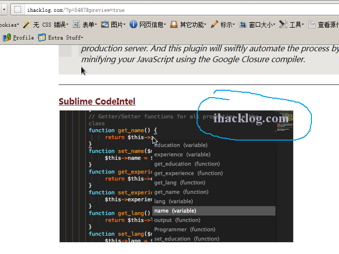

# Hacklog Remote Image Autosave #
**Contributors:** ihacklog
**Donate link:** http://ihacklog.com/donate
**Tags:** images, auto,autosave,remote
**Requires at least:** 3.2.1
**Tested up to:** 4.4.2
**Stable tag:** 2.1.0

save remote images in the posts to local server and add it as an attachment to the post.

## Description ##

This plugin can save remote images in the posts to local server automatically and 
add it as an attachment to the post.

* capabile with Hacklog Remote Attachment plugin and Watermark Reloaded plugin
* admin_icon.png was modified from runescapeautotyper.com 's donwload icon 
 
此插件的作用是自动保存日志中的远程图片到本地服务器并将保存后的文件作为日志的附件。

* 与Hacklog Remote Attachment 插件兼容性良好　
* 与Watermark Reloaded 插件兼容性良好　

@TODO
自定义img标签图片提取正则（情景描述：有些网页的 img 的图片地址不是用src属性标注的，比如微信网页版用 data-src 来标注图片地址。）
感谢 @守心斋 提出建议。

@待测试
1.随机数参数url形如http://xxxx.jpg?123。导致插件不能正常下载图片 (@walkskyer)
2.前台HTTP，HTTPS后台出现问题。无法正常显示插件页面。 (@Jakes)

@待定功能
1.自定义img标签图片提取正则 (@守心斋)
2.兼容SAE版WORDPRESS （@苏洋 ）
3.自定义路径 （@mapleaf）

* 2.1.0
  修复：下载类似于http://mmbiz.qpic.cn/mmbiz/xxxxxx/640?wx_fmt###jpeg&tp###webp&wxfrom###5&wx_lazy###1
  这种url的图片的时候，当文章中有多个图片，底部（后下载的）的图片会将前面的图片覆盖的bug.

* 2.0.9
*  修复：远程图片url没有文件名后缀时，自动添加后缀。这样在WP文章里单独点击图片文件链接时，可避免某些服务器把没有后缀的图片文件当二进制文件下载的问题。
*  修复:Error:SyntaxError: Unexpected token {. Check your HTTP Server error log or PHP error log to see what happend. (thanks to @守心斋)
*  修复: 远程服务器图片有空格到本地 LAMP 服务器显示不出来的问题 (thanks to @再袭面包屋)
*  修复: Notice: Undefined offset: 1 in /PATH-TO-WP-ROOT-DIR/wp-includes/vars.php on line 31 (thanks to @YYK)

* 2.0.0 版完全重写。相比于原来1.0.2版的插件，有非常大的改进。
* 原来的插件是在文章更新时自动下载远程图片，如果图片非常多的话，这样容易导致执行超时或只有部分图片被下载了。
* 这次的新版采用的是ajax异步请求的方式让多个文件同时下载。效率和易用性都得到很大改善。
 
## Installation ##

1. Upload the whole `hacklog-remote-image-autosave` directory to the `/wp-content/plugins/` directory
1. Activate the plugin through the 'Plugins' menu in WordPress
1. Go to `Settings`==>`Hacklog RIA` to setup the options.

## Frequently Asked Questions ##

## Screenshots ##

screenshot-1.png

screenshot-2.png

screenshot-3.png

screenshot-4.png

## Changelog ##

### 2.1.0 ###
* fixed: now the plugin can handle urls like http://mmbiz.qpic.cn/mmbiz/xxxxxx/640?wx_fmt###jpeg&tp###webp&wxfrom###5&wx_lazy###1 properly.

### 2.0.9 ###
* fixed: auto append filename extension when remote img url has no extension (like .png or .jpg)
* fixed: Error:SyntaxError: Unexpected token {. Check your HTTP Server error log or PHP error log to see what happend. (thanks to @守心斋)
* fixed: filename has %20 chars (thanks to 再袭面包屋)
* fixed: Notice: Undefined offset: 1 in /PATH-TO-WP-ROOT-DIR/wp-includes/vars.php on line 31 (thanks to @YYK)

### 2.0.8 ###
* fixed: added support for WP 3.5 for the new TinyMCE.

### 2.0.7 ###
* modified: changed image preload from css to js.
* removed some un-needed comments.

### 2.0.6 ###
* improved: DO NOT load plugin in front end.
* fixed: changed to use the WP 3.0 version Roles and Capabilities permission value

### 2.0.5 ###
* improved: the method to check whether a link resource is a picture
* fixed: the compatibility with Hacklog Remote Attachment plugin (resolved the dumplicated filename bug)

### 2.0.4 ###
* fixed: corrected the logic to check if a url is remote or not.

### 2.0.3 ###
* improved: get PHP execution timeout errors being caught.
* improved: get HTTP server 500 Internal Server Error being caught.
* improved: update the downloading status image.
* improved: added notice message after all images has been downloaded.
* added: thumbnails creating function. 

### 2.0.2 ###
* improved: added https support(the ssl verify has been set to FALSE due to some reasons).
* improved: added "Retry" button if the first time the downloading was failed.

### 2.0.1 ###
* fixed: libcurl "Operation timed out after 5008 milliseconds with 122371 out of 315645 bytes received" Error.
* modified: shortened the time interval to auto click the "OK" button.
* fixed: bug when POST data via jQuery with query string style data param the post content will be cutted strangely.

### 2.0.0 ###
* rewrtie the plugin at all.Now ,many bugs has been fixed.the plugin now works well.

### 1.0.2 ###
* fixed the bug when the hacklog remote attachment does not exists,the plugin will not save remote images.

### 1.0.1 ###
* improved the capability with Hacklog Remote Attachment plugin and Watermark Reloaded plugin.

### 1.0.0 ###
* released the first version.

## Arbitrary section ##

	if remote server is　 unreachable OR remote server Set against hotlinking，then the image url will remain as what it is in the post.
 	also ,this plugin will not handel with the situation when the remote server returns 302 http status.
 	the ssl verify has been set to FALSE due to some reasons.

